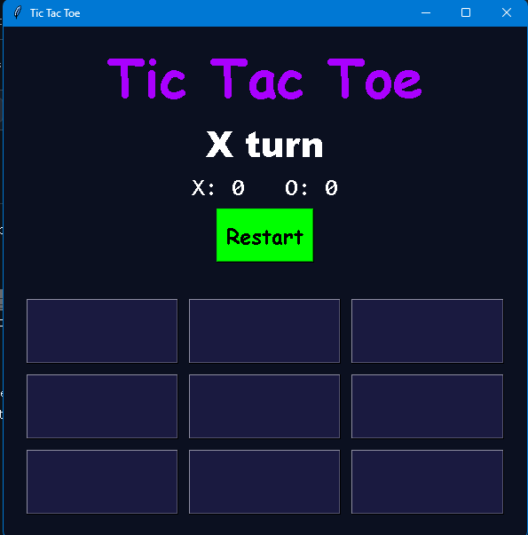
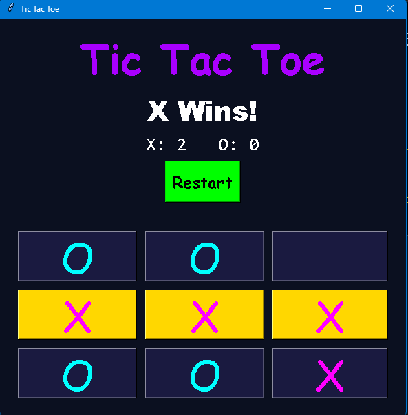

# TIC-TAC-TOE
This repository contains python based interactive Tic-Tac-Toe game.
Running Tic-Tac-Toe:
```bash
git clone https://github.com/afthahmm590-png/TIC-TAC-TOE-PROJECT1.git
cd TIC-TAC-TOE-PROJECT1/
python tictactoe-Project.py
```
## Controls
1. Player X starts the game.
2. Click on each grid to place symbol.
3. The result of the game is displayed at the end of the game.
4. A track of player scores is maintained.
5. Click anywhere on the result screen to play again.

## Screenshots
<div align="center">
  
  
</div>
## Author
Afthah Bin Rafi
